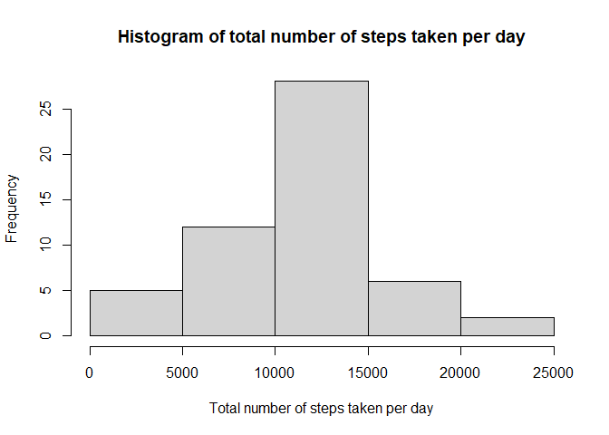
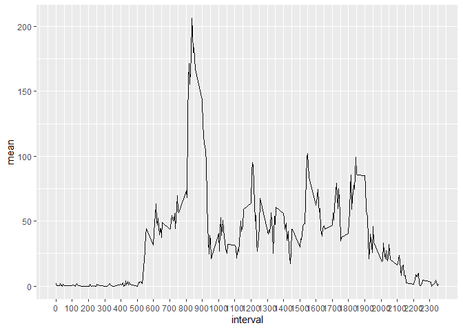
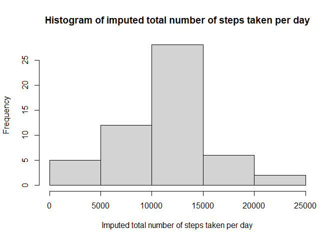

# Q1: Loading and preprocessing the data


```r
suppressMessages(library(lubridate))
suppressMessages(library(tidyr))
suppressMessages(library(dplyr))
suppressMessages(library(ggplot2))
options(scipen=999)

# Load the data
dat1<- read.csv("activity.csv")

# Process/transform the data
dat1$date <- ymd(dat1$date)
str(dat1)
```

```
## 'data.frame':	17568 obs. of  3 variables:
##  $ steps   : int  NA NA NA NA NA NA NA NA NA NA ...
##  $ date    : Date, format: "2012-10-01" "2012-10-01" ...
##  $ interval: int  0 5 10 15 20 25 30 35 40 45 ...
```

# Q2: What is mean total number of steps taken per day?

```r
#Calculate the total number of steps taken per day
dat1_sum_by_day<- dat1 %>% 
    group_by(date) %>% 
    drop_na() %>% 
    summarise(sum= sum(steps, na.rm=TRUE))

# Make a histogram of the total number of steps taken each day
hist(dat1_sum_by_day$sum, main = "Histogram of total number of steps taken per day", xlab = "Total number of steps taken per day")
```

<!-- -->

```r
# Calculate and report the mean and median of the total number of steps taken per day
mean <- round(mean(dat1_sum_by_day$sum, na.rm= T))
median <- median(dat1_sum_by_day$sum)
```
Mean total number of steps taken per day is 10766.  
Median total number of steps taken per day is 10765.


# Q3: What is the average daily activity pattern?


```r
# Prepare the data
dat1_daily_pattern <- dat1 %>% 
    group_by(interval) %>% 
    drop_na() %>% 
    summarise(mean=mean(steps))

# Make a time series plot
dat1_daily_pattern %>% ggplot(aes(y=mean, x= interval)) +
    geom_line()+
    scale_x_continuous(breaks = seq(0,2355,100))
```

<!-- -->

```r
# Find the maximum 5-minute interval
max<- dat1_daily_pattern[which(dat1_daily_pattern$mean==max(dat1_daily_pattern$mean)),1]
```
The 835th 5-minute interval contains the maximum number of steps.  

# Q4: Imputing missing values

```r
# Calculate and report the total number of missing values in the dataset
apply(is.na(dat1), 2,sum )
```

```
##    steps     date interval 
##     2304        0        0
```

```r
dat1_imputed <- dat1

# Filling in all of the missing values in the dataset
# Here I use the average of that 5-min interval
for ( i in 1:nrow(dat1_imputed)) {
    if (is.na(dat1_imputed$steps[i])){
        which_row <- which(dat1_daily_pattern$interval==dat1_imputed$interval[i])
        dat1_imputed$steps[i] <- as.numeric(dat1_daily_pattern[which_row,"mean"])
    }
}
apply(is.na(dat1_imputed), 2,sum )
```

```
##    steps     date interval 
##        0        0        0
```

```r
# Make a histogram of the total number of steps taken each day 
dat1_imputed_sum_by_day<- dat1 %>% 
    group_by(date) %>% 
    drop_na() %>% 
    summarise(sum= sum(steps, na.rm=TRUE))

hist(dat1_imputed_sum_by_day$sum, main = "Histogram of imputed total number of steps taken per day", xlab = "Imputed total number of steps taken per day")
```

<!-- -->

```r
mean_imputed <- round(mean(dat1_imputed_sum_by_day$sum),0)
median_imputed <- median(dat1_imputed_sum_by_day$sum)
```
The total number of missing values in the dataset is 2304. The average of same 5-min interval is used for imputation. From the results, nothing is changed.  
Mean total number of steps taken per day is 10766.  
Median total number of steps taken per day is 10765.


# Q5: Are there differences in activity patterns between weekdays and weekends?

```r
# Create a new factor variable in the dataset with two levels
dat1_imputed<- dat1_imputed %>% 
    mutate(weekday=weekdays(date,abbreviate=TRUE)) %>%
    mutate(weekday_factor=case_when(
        weekday %in% c("Sun","Sat") ~ "weekend",
        TRUE ~ "weekday")
    )

# Make a panel plot containing a time series plot
dat1_imputed_daily_pattern <- dat1_imputed %>% 
    group_by(interval,weekday_factor) %>% 
    summarise(mean=mean(steps))
```

```
## `summarise()` has grouped output by 'interval'. You can override using the `.groups` argument.
```

```r
dat1_imputed_daily_pattern %>% ggplot(aes(y=mean, x= interval)) +
    geom_line(aes(col=weekday_factor))+
    facet_grid(weekday_factor~.)+
    scale_x_continuous(breaks = seq(0,2355,100))+
    theme_bw()
```

<!-- -->

